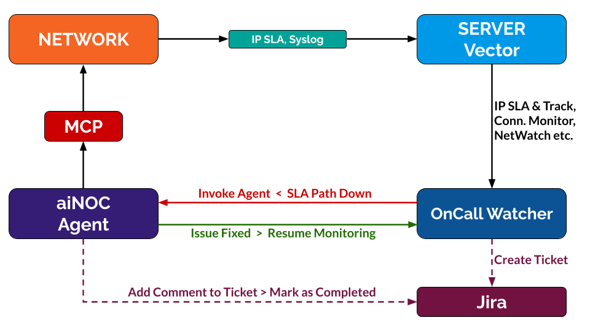

# ✨ aiNOC

[](https://github.com/pdudotdev/aiNOC/releases/tag/3.0.0)
[](https://github.com/pdudotdev/aiNOCcommits/main/)

## 📖 **Table of Contents**
- 📜 **Lab Manual**
  - [🔭 Overview](#-overview)
  - [🌱 AI Automation 101](#-ai-automation-101)
  - [♻️ Repository Lifecycle](#%EF%B8%8F-repository-lifecycle)
  - [⭐ What's New in v3.0](#-whats-new-in-v30)
  - [📞 On-Call Mode](#-on-call-mode)
  - [⚒️ Project Tech Stack](#%EF%B8%8F-project-tech-stack)
  - [📋 Included Vendors](#-included-vendors)
  - [🎓 Networking Topics](#-networking-topics)
  - [🛠️ Environment Setup](#%EF%B8%8F-environment-setup)
  - [⏰ NTP, Syslog, Vector](#-ntp-syslog-vector)
  - [📂 Router OS Images](#-router-os-images)
  - [🖥️ Terminal Management](#%EF%B8%8F-terminal-management)
  - [🔄 Network Topology](#-network-topology)
  - [🌱 Starting Fresh](#-starting-fresh)
  - [⬆️ Planned Upgrades](#%EF%B8%8F-planned-upgrades)
  - [📄 Disclaimer](#-disclaimer)
  - [📜 License](#-license)

## 🔭 Overview
The purpose of this project is to showcase the capabilities of **Claude Code**, **MCP**, **Python**, and other tools, in regards to troubleshooting and automating network tasks.

**Key characteristics:**
- [x] **Multi-vendor**
- [x] **Multi-protocol**
- [x] **Multi-area/multi-AS**
- [x] **SSH/eAPI/REST API**
- [x] **OSI L3-focused**

Operating modes of **aiNOC**:
- [x] **Standalone mode (ST)**
  - User specifies network issue and symptomps at the prompt
- [x] **On-Call mode (OC)**
  - Agent is invoked by SLA path failure, see [**On-Call Mode**](#-on-call-mode)

**Agent guardrails**:
- [x] See [guardrails.txt](metadata/about/guardrails.txt)

**Supported models**:
- [x] Haiku 4.5 (best for costs)
- [x] Sonnet 4.6
- [x] Opus 4.6

**High-level architecture:**



⚠️ **NOTE**: This project assumes **CCNP**-level knowledge, as well as familiarity with **Linux** terminal commands, **Python** syntax, and multi-vendor **CLIs**.

## 🌱 AI Automation 101
If you're completely new to Network Automation using AI & MCP, then you may want to [start here](#-starting-fresh) before moving on with this lab.

## ♻️ Repository Lifecycle
This repository is **NOT** static. I am periodically adding **new features** (devices, vendors, protocols, configs, optimizations).

**Stay up-to-date**:
- [x] **Watch** and **Star** this repository

**Current version**:
- [x] **aiNOC v3.0**

## ⭐ What's New in v3.0
• The **v3.0.0** upgrade is focused on:
- [x] Multi-mode operations
- [x] Improving diagnosis flow
- [x] Optimizing AI performance
- [x] Less hallucinations and costs

• Updates for MTTR and costs:
- [x] Added **mcp_tool_map.json** for better use of the MCP tooling
- [x] Added **sla_paths.json** for clean paths to monitor
- [x] Updated **INTENT.json** for cleaner network context
- [x] Added **CLAUDE.md** with clear workflows and guidance
- [x] Added specific **skills** for troubleshooting coherence
- [x] Added **cases.md** and **lessons.md** (see **/cases.example**)
- [x] aiNOC documents each case and curates lessons for future use

• Enhancements:
- [x] Well-defined test suites
- [x] Regression tests checklist
- [x] MikroTik API reference
- [x] Minor bug fixing

## 📞 On-Call Mode
**On-Call Mode** has been introduced in v3.0.

### What it does, in a nutshell?
- [x] User configures connectivity paths in the network
  - **Cisco**: IP SLA & tracking
  - **Arista**: Monitor Connectivity
  - **MikroTik**: NetWatch
- [x] User configures **Syslog** and **NTP**
- [x] User configures **Syslog** server (Vector)
- [x] User configures **Vector** with correct parser
- [x] Connectivity path failures are logged to **Syslog**
- [x] **Vector** listens for and parses multi-vendor logs
- [x] `sla_paths/paths.json` outlines paths for the agent
- [x] `oncall_watcher.py` monitors Vector for new logs
- [x] Once a new log arrives, the agent is invoked
- [x] Agent gets log details pre-filled in prompt
- [x] Agent starts troubleshooting procedures
- [x] Agent invocations are logged to `oncall_watcher.log`
- [x] Skipped events are deferred for later analysis

**NOTE:** See section [⏰ NTP, Syslog, Vector](#-ntp-syslog-vector) for configs.

## ⚒️ Project Tech Stack
The main tools and technologies used for building the project:
- [x] Claude Code
- [x] MCP (FastMCP)
- [x] ContainerLab
- [x] Python
- [x] Scrapli
- [x] Genie
- [x] REST API
- [x] EOS eAPI
- [x] Vector
- [x] Ubuntu
- [x] VS Code
- [x] VirtualBox/VMware

## 📋 Included Vendors
- [x] **Arista**: EOS (cEOS)
- [x] **Cisco**: IOS/IOS-XE (IOL)
- [x] **MikroTik**: RouterOS

## 🎓 Networking Topics
Networking topics in this topology:
- [x] **OSPF multi-area**:
  - Basic protocol config
    - Reference bandwidth
    - Point-to-point links
    - Passive interfaces
    - MD5 authentication
    - External type 1 routes
  - Route redistribution EIGRP-OSPF
  - Route summarization (ABR)
  - Route filtering with prefix lists
  - Route filtering with distribute lists
  - Area types: normal, totally stubby, totally nssa

- [x] **EIGRP**:
  - Basic protocol config
    - Passive interfaces
    - MD5 authentication
    - Stub connected/summary
  - Local summarization
  - Route redistribution OSPF-EIGRP
  - Default metric via route map

- [x] **BGP**:
  - eBGP/iBGP neighbors
  - iBGP next-hop-self
  - ISP default-originate
  - Prefix list and route map
  - Route reflector in ISP A
  - *More to come soon*

- [x] **Others**:
  - Policy-Based Routing
  - IP SLA icmp-echo
  - MikroTik Netwatch
  - NAT/PAT on ASBRs
  - Management APIs
  - Syslog, NTP

## 🛠️ Environment Setup
Below you'll find guidance for building the lab before you move to the network topology section.

**My VM resources for this lab**:
- [x] VirtualBox or VMware
- [x] Ubuntu 24.04.4 VM
- [x] 12 processor cores
- [x] 32 GB RAM memory
- [x] 50 GB hard disk

**Resource consumption**:</br>
Resources are not yet fully used, but they need to account for peak network usage and future expansions of the lab.
```
free -h
               total        used        free      shared  buff/cache   available
Mem:            31Gi        14Gi        10Gi       732Mi       7.8Gi        16Gi
```

**Summary checklist**:
- [x] VirtualBox or VMware, Ubuntu VM
- [x] Initial configuration:
```
sudo apt update && sudo apt upgrade -y
sudo apt install python3.12-venv python3-pip curl git
```
- [x] Install VS Code.
- [x] Directory setup:
```
git clone https://github.com/pdudotdev/aiNOC/
cd aiNOC
python3 -m venv mcp
source mcp/bin/activate
pip install --upgrade pip
pip install -r requirements.txt
```
- [x] Docker engine:
```
sudo apt update
sudo apt install ca-certificates
sudo install -m 0755 -d /etc/apt/keyrings
sudo curl -fsSL https://download.docker.com/linux/ubuntu/gpg -o /etc/apt/keyrings/docker.asc
sudo chmod a+r /etc/apt/keyrings/docker.asc

sudo tee /etc/apt/sources.list.d/docker.sources <<EOF
Types: deb
URIs: https://download.docker.com/linux/ubuntu
Suites: $(. /etc/os-release && echo "${UBUNTU_CODENAME:-$VERSION_CODENAME}")
Components: stable
Signed-By: /etc/apt/keyrings/docker.asc
EOF

sudo apt update
sudo apt install docker-ce docker-ce-cli containerd.io docker-buildx-plugin docker-compose-plugin
sudo systemctl status docker
sudo docker run hello-world
```
- [x] Containerlab:
```
curl -sL https://containerlab.dev/setup | sudo -E bash -s "all"
newgrp docker
clab --help
clab version
```
- [x] Containerlab common commands:
```
containerlab deploy -t lab.yml
containerlab save -t lab.yml
containerlab inspect -t lab.yml
containerlab redeploy -t lab.yml
docker exec -it <container-name/id> Cli     (-i interactive, -t pseudo-tty/terminal)

containerlab graph -t lab.yml
containerlab destroy -t lab.yml
```
- [x] Claude Code:
```
curl -fsSL https://claude.ai/install.sh | bash
echo 'export PATH="$HOME/.local/bin:$PATH"' >> ~/.bashrc && source ~/.bashrc
claude doctor
```
- [x] Claude auth (needs **API key**):
```
claude auth login
```
- [x] Claude ↔ MCP server:
```
claude mcp add mcp_automation -s user -- ./mcp/bin/python MCPServer.py
claude mcp list
```

## ⏰ NTP, Syslog, Vector
### Configuring NTP server on Ubuntu
- [x] Install Chrony:
```
sudo apt update
sudo apt install chrony -y
sudo nano /etc/chrony/chrony.conf
```

- [x] Add these lines:
```
# Allow containerlab subnet
allow 172.20.20.0/24

# Listen on all interfaces
bindaddress 0.0.0.0
```

- [x] Verifications:
```
sudo systemctl restart chrony
sudo systemctl enable chrony

systemctl is-enabled chrony
ss -ulpn | grep 123
chronyc tracking
chronyc sources
```

### Configuring NTP on the routers
- [x] **Arista**:
```
ntp server 172.20.20.1 prefer
show ntp associations
show ntp status
```

- [x] **Cisco**:
```
ntp server vrf clab-mgmt 172.20.20.1
ntp source Ethernet0/0
ntp update-calendar
show ntp associations
show ntp status
```

- [x] **Mikrotik**:
```
/system ntp client set enabled=yes
/system ntp client set servers=172.20.20.1
/system/ntp/client/print
```

### Configuring Syslog on the routers
- [x] **Arista**:
```
logging trap 6
logging format rfc5424
logging host 172.20.20.1
```

- [x] **Cisco**:
```
logging trap 6 syslog-format rfc5424
logging host 172.20.20.1 vrf clab-mgmt
logging source-interface Ethernet0/0 vrf clab-mgmt
```

- [x] **Mikrotik**:
```
/system/logging/action/add name=remoteSyslog target=remote remote=172.20.20.1 remote-port=514 src-address=0.0.0.0  
/system/logging/action/set remoteSyslog syslog-facility=local7
/system/logging/action/set remoteSyslog syslog-time-format=bsd-syslog remote-log-format=syslog
/system logging add action=remoteSyslog topics=netwatch,info
```

### Installing and configuring Vector
- [x] Download [Vector](https://vector.dev/download/)
- [x] Choose .deb and (x86_64 or ARM)
- [x] `sudo dpkg -i vector_0.53.0-1_amd64.deb`
- [x] Edit `sudo nano /etc/vector/vector.yaml`:
```
data_dir: "/var/lib/vector"

sources:
  syslog:
    type: syslog
    address: "0.0.0.0:514"
    mode: udp

transforms:
  sla_events:
    type: remap
    inputs: ["syslog"]
    source: |
      . = {
        "ts": .timestamp,
        "device": .source_ip,
        "severity": .severity,
        "facility": .facility,
        "msg": .message
      }

sinks:
  file:
    type: file
    inputs: ["sla_events"]
    path: "/var/log/network.json"
    encoding:
      codec: json
```
- [x] Create output file & permissions
```
sudo touch /var/log/network.json
sudo chown vector:vector /var/log/network.json
```
- [x] Start Vector:
```
sudo systemctl restart vector
sudo systemctl status vector
```
- [x] Monitor Vector:
```
tail -f /var/log/network.json
sudo tcpdump -ni any udp port 514
sudo ss -lunp | grep 514
```

### Configuring the connectivity paths
- [x] Already configured in [lab_configs/](https://github.com/pdudotdev/aiNOC/tree/main/lab_configs)

## 📂 Router OS Images
### Arista EOS
- [x] Download the official [Arista cEOS](https://www.arista.com/en/login) image.
- [x] You need to import it into Docker using:
```
sudo docker import ~/cEOS64-lab-4.35.0F.tar.xz ceos:4.35.0F
docker images
```
- [x] Containerlab's [documentation for EOS](https://containerlab.dev/manual/kinds/ceos/)

### Cisco IOS
You are responsible of getting your own Cisco IOL file, however here's a starting point:
- [x] Containerlab's [documentation for IOL](https://containerlab.dev/manual/kinds/cisco_iol/)

### MikroTik RouterOS
- [x] Go to https://mikrotik.com/download/chr
- [x] Download the **VMDK image**
- [x] `cp Downloads/chr-7.20.8.vmdk vrnetlab/mikrotik/routeros/`
- [x] `cd ~/vrnetlab/mikrotik/routeros/`
- [x] `make docker-image`
- [x] Check with: `docker images`
- [x] Output:
`vrnetlab/mikrotik_routeros:7.20.8   a918b39e9772        976MB`
- [x] Now you'll be able to use **mikrotik_ros** in your **lab.yml** file.
- [x] Containerlab's [documentation for RouterOS](https://containerlab.dev/manual/kinds/vr-ros/)

## 🖥️ Terminal Management
Since we're dealing with a complex topology containing many devices, we need to make our lives easier when it comes to the **management connections**.

For this reason, I'm using **Tabby**:
- [x] Download link [here](https://tabby.sh/)
- [x] The installer is **tabby-1.0.230-linux-x64.deb** (version no. might differ)
- [x] Installation: `sudo dpkg -i tabby-1.0.230-linux-x64.deb`
- [x] Start it with `tabby` and pin it to the Dash
- [x] Go to **Settings - Profiles & connections - New - New Profile Group**
- [x] Go to **New - New profile - SSH connection**, name it **R1A**, assign it to your Group
- [x] Scroll down to **Connection**, Host 172.20.20.201 (see **lab.yml** below ), Port 22
- [x] Set **Username** to **admin**. Set a **Password** in the keychain, also **admin**.
- [x] Hit **Save**. Do this for each router after you create your topology.
- [x] Connect to each device using the ▶︎ button. You may be prompted for the password again.
- [x] To quickly create the same connection type for each router, **Duplicate** R1A, then just change the name and IP address.

## 🔄 Network Topology
- [x] **Network diagram**:


**Connection types:**
- [x] Multiple connection types, for diversity:
  - **Cisco IOS**: Scrapli SSH
  - **Arista EOS**: Arista eAPI
  - **MikroTik RouterOS**: REST API

**Important files:**
- [x] Containerlab: **lab.yml**
- [x] Inventory: **NETWORK.json** 
- [x] State: **INTENT.json**
- [x] Policy: **MAINTENANCE.json**
- [x] SLA Paths: **sla_paths/paths.json**
- [x] Tool Map: **mcp_tool_map.json**

**Network devices:**
- [x] Router naming convention:
  - **RXY** where:
    - **R**: device type (router)
    - **X**: device number id
    - **Y**: vendor (A-Arista, C-Cisco, M-MikroTik, etc.)

- [x] Interface naming convention:
  For example, the first usable data interface is **1** *(**0** is the Mgmt interface assigned by Containerlab)*. This is equivalent to:
  - **eth1** on Arista
  - **e0/1** on Cisco
  - **ether2** on MikroTik (see comments and link in **lab.yml**)

- [x] Default SSH credentials:
  - Arista: `admin:admin`
  - Cisco: `admin:admin`
  - MikroTik: `admin:admin`

- [x] **.env** credentials file:
```
ROUTER_USERNAME=admin
ROUTER_PASSWORD=admin
```

- [x] Router configurations:
  - Please find all the configuration files under the [/lab_configs](https://github.com/pdudotdev/aiNOC/tree/main/lab_configs) directory
  - They are the network's fallback configs whenever you use `containerlab redeploy -t lab.yml`

## 🌱 Starting Fresh
I have a [beginner-friendly course](https://www.udemy.com/course/mcp-server/?referralCode=D62613A8194D2D915B55) on Udemy on how to setup everything from scratch and build your first AI and MCP-based network automation project. Although a shameless plug, I highly recommend going through that course before moving on with this lab.

Now let's go [back](#%EF%B8%8F-repository-lifecycle) to the top of this lab manual.

**Join the course to also get:**
- [x] Full instructor support (Q&A)
- [x] Upgrades on a regular basis
- [x] Access to a private Discord

## ⬆️ Planned Upgrades
Expected in version v4.0:
- [ ] New branch and vendors
- [ ] Performance-based SLAs
- [ ] Netbox integration

## 📄 Disclaimer
This project is intended for educational purposes only. You are responsible for building your own lab environment and meeting the necessary conditions (e.g., RAM/vCPU, router OS images, Claude subscription/API key, etc.).

## 📜 License
Licensed under the [GNU GENERAL PUBLIC LICENSE Version 3](https://github.com/pdudotdev/aiNOC/blob/main/LICENSE).