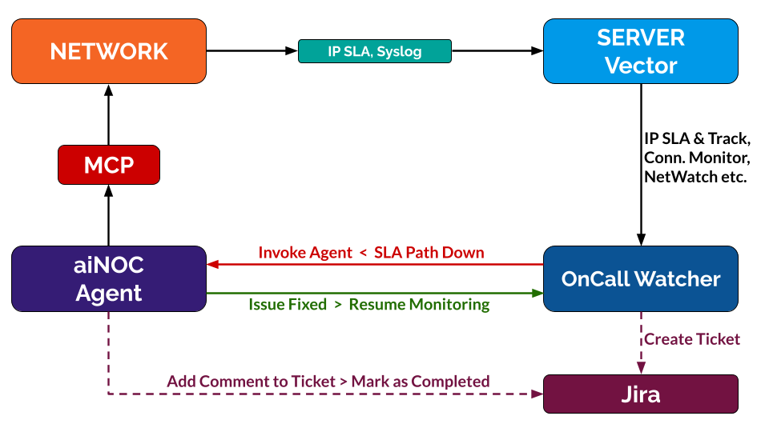

# ✨ aiNOC

[](https://github.com/pdudotdev/aiNOC/releases/tag/4.0.4)
[](https://github.com/pdudotdev/aiNOCcommits/main/)

## 📖 **Table of Contents**
- 📜 **aiNOC Project**
  - [🔭 Overview](#-overview)
  - [♻️ Repository Lifecycle](#%EF%B8%8F-repository-lifecycle)
  - [🍀 Here's a Quick Demo](#-heres-a-quick-demo)
  - [⭐ What's New in v4.0](#-whats-new-in-v40)
  - [⚒️ Current Tech Stack](#%EF%B8%8F-current-tech-stack)
  - [📋 Supported Vendors](#-supported-vendors)
  - [🖇️ Supported Transports](#-supported-transports)
  - [🎓 Troubleshooting Scope](#-troubleshooting-scope)
  - [🛠️ Installation & Usage](#%EF%B8%8F-installation-usage)
  - [🔄 Test Network Topology](#-test-network-topology)
  - [📞 aiNOC in On-Call Mode](#ainoc-in-on-call-mode)
  - [⬆️ Planned Upgrades](#%EF%B8%8F-planned-upgrades)
  - [🌱 AI Automation 101](#-ai-automation-101)
  - [📄 Disclaimer](#-disclaimer)
  - [📜 License](#-license)
  - [📧 Professional Collaborations](#-professional-collaborations)

## 🔭 Overview
aiNOC is an AI-based **network troubleshooting framework** for multi-vendor, multi-protocol, multi-area/multi-AS, OSI L2-L4 enterprise networks.

**Key characteristics:**
- [x] **Multi-vendor support**
- [x] **Multi-protocol, L2-L4**
- [x] **Multi-area/multi-AS**
- [x] **SSH/eAPI/REST API**
- [x] **16 MCP tools, 6 skills**
- [x] **32 operational guardrails**
- [x] **Jira integration**

Operating modes of **aiNOC**:
- [x] **Standalone mode (ST)**
  - User specifies network issue and symptoms at the prompt
- [x] **On-Call mode (OC)**
  - Agent is invoked by SLA path failures, see [**On-Call Mode**](#-on-call-mode)

**Important project files**:
- [x] See [**file roles**](metadata/about/file_roles.md)

**Agent guardrails list**:
- [x] See [**guardrails**](metadata/about/guardrails.md)

**Supported models**:
- [x] Haiku 4.5 (best for costs)
- [x] Sonnet 4.6 (default)
- [x] Opus 4.6 (best reasoning)

**Set your default model**:
Create `settings.json` under `.claude/`:
```
{
  "model": "sonnet"
}
```

**High-level architecture:**



## 🍀 Here's a Demo
- [x] ▶ See a [**DEMO HERE**](https://www.youtube.com/watch?v=oxSa25R6EgI) for v3.0.
  - *Next video demo coming with v5.0*

## ♻️ Repository Lifecycle
**New features** are being added periodically (vendors, protocols, integrations, etc.).

**Stay up-to-date**:
- [x] **Watch** and **Star** this repository

**Current version**:
- [x] **aiNOC v4.0**

## ⭐ What's New in v4.0

v4.0 is a major **quality, reliability, and security** release - no new protocols or vendors, but a hardened foundation for v5.0.

**Security & Safety:**
- [x] `push_config` now enforces maintenance windows (blocked outside policy)
- [x] `run_show` restricted to read-only commands (no config bypass)
- [x] RouterOS REST validation - forbidden paths blocked, POST rejected
- [x] Syslog prompt injection mitigation (sanitize + delimiter)
- [x] Expanded forbidden command set (5 → 14 patterns)
- [x] TLS/SSL configurable per transport (`VERIFY_TLS`, `ROUTEROS_USE_HTTPS`, `SSH_STRICT_HOST_KEY`)

**Architecture:**
- [x] Monolithic `MCPServer.py` (798 lines) decomposed into `tools/`, `transport/`, `core/`, `input_models/`
- [x] Bounded LRU cache (256 entries, TTL-based eviction)
- [x] Connection pooling for eAPI and REST transports
- [x] HTTP timeouts on all device and Jira connections
- [x] Structured JSON logging with configurable levels

**Troubleshooting Methodology:**
- [x] 6 Core Troubleshooting Principles (mandatory, ordered) - see `CLAUDE.example.md`
- [x] Standalone Mode rewritten - 10 deterministic steps with decision gates
- [x] Protocol skill prerequisite gates (interfaces + neighbors verified before deep investigation)
- [x] Role-aware risk assessment using `INTENT.json` and SLA paths

**On-Call & Operational:**
- [x] SLA recovery (Up) event detection and logging
- [x] Daemon mode (`-d` flag) with tmux session support
- [x] systemd service file (`oncall/oncall-watcher.service`) for production deployment
- [x] Pre-change snapshot support in `push_config`
- [x] Rollback advisory generation for all config changes

**Testing:**
- [x] 230 unit tests across 9 test files (up from 3 in v3.0)
- [x] 4 integration test files with `NO_LAB` skip guards
- [x] 12 manual E2E scenarios (7 standalone, 1 on-call, 1 maintenance window, 3 watcher)
- [x] Pydantic `Literal` validation on all query parameters

## ⚒️ Tech Stack

| Tool | ✓ |
|------|---|
| Claude Code | ✓ |
| MCP (FastMCP) | ✓ |
| ContainerLab | ✓ |
| Python | ✓ |
| Scrapli | ✓ |
| Genie | ✓ |
| REST API | ✓ |
| EOS eAPI | ✓ |
| Jira API | ✓ |
| Vector | ✓ |
| Ubuntu | ✓ |
| VS Code | ✓ |
| VirtualBox/VMware | ✓ |

## 📋 Supported Vendors

| Vendor | Platform |
|--------|----------|
| Arista | EOS (cEOS) |
| Cisco | IOS/IOS-XE (IOL) |
| MikroTik | RouterOS |

## 🖇️ Supported Transports

| Vendor | Transport |
|--------|-----------|
| Cisco IOS | Scrapli SSH |
| Arista EOS | Arista eAPI |
| MikroTik RouterOS | REST API |

## 🎓 Troubleshooting Scope

| Category | Capabilities |
|----------|-------------|
| **OSPF** | Reference bandwidth · Point-to-point links · Passive interfaces · MD5 authentication · External type 1 routes · Default route injection · ABR route summarization · EIGRP ↔ OSPF redistribution · Prefix list filtering · Distribute list filtering · Area types: normal, stubby, totally NSSA |
| **EIGRP** | Passive interfaces · MD5 authentication · Stub summary · OSPF ↔ EIGRP redistribution · Default metric via route maps |
| **BGP** | eBGP dual-ISP · Default-originate · Prefix lists and route maps · Route reflectors and clients |
| **Others** | Policy-Based Routing · IP SLA · MikroTik Netwatch · Arista Connectivity Monitor · NAT/PAT on ASBRs · Management APIs · Static routing · Syslog · NTP |

## 🛠️ Installation
**Step 1**:
```
git clone https://github.com/pdudotdev/aiNOC/
cd aiNOC
python3 -m venv mcp
source mcp/bin/activate
pip install --upgrade pip
pip install -r requirements.txt
```

**Step 2**:

The included **CLAUDE.md** and **skills** are templates. **Customize them** with your own troubleshooting methodology, tool descriptions, and operational guidelines.

**Step 3**:
- Configure IP SLA, Connectivity Monitor, Netwatch etc. paths in your network
- Make sure they are being tracked and logged remotely to **Vector** (Syslog)
- Configure the transforms inside `/etc/vector/vector.yaml` - [**example**](metadata/about/vector.yaml)
- aiNOC monitors Vector's `/var/log/network.json` file for specific logs and parses them

**Step 4**:
Run **aiNOC** in **On-Call Mode**, in the terminal or as a **daemon**:
```
python3 oncall_watcher.py      # default: interactive terminal
python3 oncall_watcher.py -d   # daemon mode, across reboots
```

**Step 5**:
Check if **Watcher** and **Vector** are running:
```
sudo systemctl status oncall_watcher.service
sudo systemctl status vector
```

## 🔄 Test Network Topology
**Network diagram**:


**Naming conventions:**
- [x] **RXY** where:
  - **R**: device type (router)
  - **X**: device number id
  - **Y**: vendor (A-Arista, C-Cisco, M-MikroTik, etc.)

**Router configurations:**
- [x] Please find my test lab's config files under the [**lab_configs**](https://github.com/pdudotdev/aiNOC/tree/main/lab_configs) directory
- [x] They are the network's fallback configs for `containerlab redeploy -t lab.yml`
- [x] Default credentials: see **.env** file at [**.env.example**](.env.example)

## 📞 On-Call Mode
**On-Call Mode** was introduced in v3.0 and enhanced in v4.0.

### What it does, in a nutshell?
- [x] User configures connectivity paths
  - **Cisco**: IP SLA & tracking
  - **Arista**: Connectivity Monitor
  - **MikroTik**: NetWatch
- [x] User configures **Syslog** and **NTP**
- [x] User configures **Syslog** server (Vector)
- [x] User configures **Vector** with correct transforms
- [x] Connectivity path failures are logged to **Syslog**
- [x] **Vector** listens for and parses multi-vendor logs
- [x] `sla_paths/paths.json` outlines paths for the agent
- [x] `oncall/watcher.py` monitors Vector for new logs
- [x] Once a new log arrives, the agent is invoked
- [x] Watcher creates a new Jira ticket
- [x] Agent gets log details pre-filled in prompt
- [x] Agent starts troubleshooting procedures
- [x] Identifies root cause and potential fix
- [x] Upon user approval, applies and verifies the fix
- [x] Logs results to Jira ticket and marks completion
- [x] Actions logged to `oncall/oncall_watcher.log`
- [x] Skipped events are deferred for later analysis

## ⬆️ Planned Upgrades
Expected in version v5.0:
- [ ] Fresh, enterprise-focused topology
- [ ] New vendors (Juniper, Aruba, SONiC)
- [ ] New protocols (VRRP/HSRP, STP/MSTP)
- [ ] Performance-based SLAs
- [ ] NetBox integration

## 🌱 AI Automation 101
If you're completely new to Network Automation using AI & MCP, then you may want to [**start here**](https://www.udemy.com/course/mcp-server/?referralCode=D62613A8194D2D915B55) before moving on.

## 📄 Disclaimer
You are responsible for defining your own troubleshooting methodologies and context files, as well as building your own test environment and meeting the necessary conditions (e.g., RAM/vCPU, router OS images, Claude subscription/API key, etc.).

## 📜 License
Licensed under the [**GNU GENERAL PUBLIC LICENSE Version 3**](https://github.com/pdudotdev/aiNOC/blob/main/LICENSE).

## 📧 Professional Collaborations
Interested in customizing and adapting **aiNOC** to your own network, or looking to collaborate long-term?
- **Email Address**:  
  - Please direct your inquiries to **hello@ainoc.dev**.
- **LinkedIn**:
  - Send me a DM on [**LinkedIn**](https://www.linkedin.com/in/tmihaicatalin/) and let's talk. 