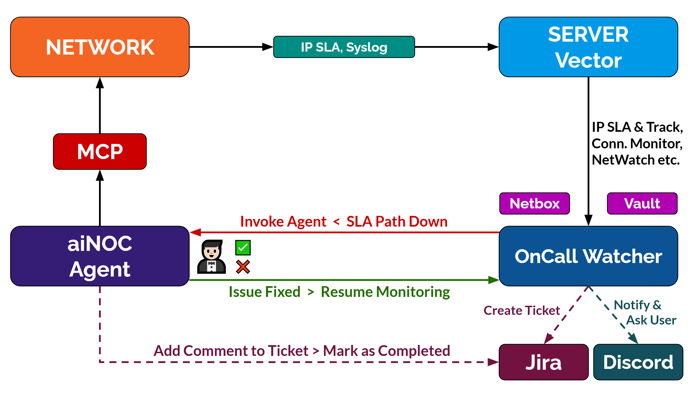

# ✨ aiNOC

[](https://github.com/pdudotdev/aiNOC/releases/tag/5.5.0)

[](https://github.com/pdudotdev/aiNOC/commits/main/)

| | |
|---|---|
| | **Core Version** |
| **Vendors** |  |
| **Management** |   |
| **Integrations** |     |
| | **On-Request** |
| **Vendors** |       |
| **Management** |     |
| | **Stats** |
| **Performance** |    |

## 📖 **Table of Contents**
- 📜 **aiNOC**
  - [🔭 Overview](#-overview)
  - [🍀 Here's a Quick Demo](#-heres-a-quick-demo)
  - [⭐ What's New in v5.5](#-whats-new-in-v55)
  - [⚒️ Current Tech Stack](#️-current-tech-stack)
  - [📋 Supported Vendors](#-supported-vendors)
  - [🚛 Supported Transports](#-supported-transports)
  - [🎓 Troubleshooting Scope](#-troubleshooting-scope)
  - [🛠️ Installation & Usage](#️-installation--usage)
  - [🔄 Test Network Topology](#-test-network-topology)
  - [📞 aiNOC Service Mode](#-ainoc-service-mode)
  - [⬆️ Planned Upgrades](#️-planned-upgrades)
  - [♻️ Repository Lifecycle](#️-repository-lifecycle)
  - [📄 Disclaimer](#-disclaimer)
  - [📜 License](#-license)
  - [📧 Collaborations](#-collaborations)

## 🔭 Overview
AI-based **network troubleshooting framework** for multi-vendor, multi-protocol, multi-area/multi-AS enterprise networks.

▫️ **Key characteristics:**
- [x] **Multi-vendor support**
- [x] **Multi-protocol, L2/L3**
- [x] **Multi-area/multi-AS**
- [x] **CLI/RESTCONF (Core)**
- [x] **NETCONF/REST/gNMI/eAPI (extensions)**
- [x] **15 MCP tools, 4 skills**
- [x] **12 operational guardrails**
- [x] **HITL for any config changes**
- [x] **Dashboard for agent monitoring**
- [x] **Discord integration**
- [x] **Jira integration**
- [x] **HashiCorp Vault**
- [x] **NetBox**

▫️ **Core vs. On-Request features**:
- [x] **Core**: 
  - Easy to integrate in Cisco IOS/IOS-XE environments
  - CLI + RESTCONF transports, OSPF/BGP troubleshooting
  - Service Mode, Jira integration, Discord integration
- [x] **On-Request**: 
  - Custom vendor modules (Arista, Juniper, MikroTik, etc.)
  - Custom vendor transports (REST, NETCONF, gNMI, eAPI) 
  - Built and adapted per client's network environment

▫️ **aiNOC operating mode in v5.0+**:
- [x] See [**aiNOC Service Mode**](#-ainoc-service-mode)

▫️ **Important project files**:
- [x] See [**file roles**](metadata/about/file_roles.md)

▫️ **Agent guardrails list**:
- [x] See [**guardrails**](metadata/about/guardrails.md)

▫️ **Adding new protocols or vendors**:
- [x] See [**scalability guide**](metadata/about/scalability.md)

▫️ **Supported models**:
- [x] Haiku 4.5
- [x] Sonnet 4.6
- [x] Opus 4.6 (default, best reasoning)

⚠️ **NOTE:** Due to the intermittent nature of troubleshooting, it's worth using an advanced model by default. Costs won't become unsustainable even if addressing and fixing several issues per day.

▫️ **Set your default model**:<br/>
Create `settings.json` under `.claude/`:
```
{
  "model":"opus",
  "effortLevel":"medium"
}
```

▫️ **High-level architecture:**



## 🍀 Here's a Quick Demo
- [x] *Demo video for v5.0 coming soon*

## ⭐ What's New in v5.5
- [x] See [**changelog.md**](changelog.md)

## ⚒️ Core Tech Stack

| Tool |   |
|------|---|
| Claude Code | ✓ |
| MCP (FastMCP) | ✓ |
| Python | ✓ |
| Scrapli | ✓ |
| Genie | ✓ |
| RESTCONF | ✓ |
| Jira API | ✓ |
| Discord API | ✓ |
| HashiCorp Vault | ✓ |
| NetBox | ✓ |
| Vector | ✓ |
| Ubuntu | ✓ |
| ContainerLab | ✓ |

## 📋 Supported Vendors

| Vendor | Platform | cli_style | Status |
|--------|----------|-----------|--------|
| Cisco | IOS-XE | `ios` | Core |
| Arista | EOS | `eos` | On-Request |
| Juniper | JunOS | `junos` | On-Request |
| MikroTik | RouterOS | `routeros` | On-Request |
| Aruba | AOS-CX | `aos` | On-Request |
| SONiC | FRR | `frr` | On-Request |
| VyOS | VyOS | `vyos` | On-Request |

## 🚛 Supported Transports

| Management | Devices | Tier | Status |
|-----------|---------|------|--------|
| RESTCONF | Cisco IOS-XE | Primary | Core |
| CLI | Cisco IOS-XE | Fallback | Core |
| NETCONF | custom | — | On-Request |
| REST API | custom | — | On-Request |
| gNMI | custom | — | On-Request |
| eAPI | Arista | — | On-Request |

## 🎓 Troubleshooting Scope

| aiNOC Core |
|----------|
| **OSPF** |
| **BGP**  | 
| **Redistribution** | 
| **Policy-based routing**|
| **Route-maps, prefix lists** |
| **NAT/PAT, access lists** |

| aiNOC On-Request Extensions |
|----------|
| **EIGRP** |
| **HSRP** | 
| **VRRP** |
| **STP/MSTP** | 
| *etc.* |

## 🛠️ Installation & Usage
▫️ **Step 1**:
```
git clone https://github.com/pdudotdev/aiNOC/
cd aiNOC
python3 -m venv mcp
source mcp/bin/activate
pip install --upgrade pip
pip install -r requirements.txt
```

▫️ **Step 2**:
The included `CLAUDE.md` and `skills/*` are templates. **Customize them** with your own troubleshooting methodology, tool descriptions, and operational guidelines.

⚠️ **NOTE**: There is no one-size-fits-all `CLAUDE.md` or `SKILL.md` that works in any network environment. These should be customized for each specific topology, vendor combination, and architecture.

▫️ **Step 3**:
- Configure IP SLA (or Connectivity Monitor, Netwatch etc.) paths in your network
- Make sure they are being tracked and logged remotely to **Vector** (Syslog)
- Configure the transforms inside `/etc/vector/vector.yaml` - [**example**](metadata/about/vector.yaml)
- aiNOC monitors Vector's `/var/log/network.json` file for specific logs and parses them per-vendor

▫️ **Step 4**:
Run the **aiNOC** watcher and dashboard services. 
Claude is invoked non-interactively via **tmux + print mode** (`-p`) with a default prompt template. 
The human operator monitors agent operations via the **web dashboard on <IP>:5555**, and interacts via **Discord** (fix approval ✅ or rejection ❌ embeds).

```
sudo apt install tmux
sudo cp oncall/oncall-watcher.service /etc/systemd/system/
sudo cp dashboard/oncall-dashboard.service /etc/systemd/system/
sudo systemctl daemon-reload
sudo systemctl enable --now oncall-watcher.service
sudo systemctl enable --now oncall-dashboard.service
```
Manage with:
`systemctl start | stop | restart | status oncall-watcher`

▫️ **Step 5**:
Check if the **service** and **Vector** are running:
```
sudo systemctl status vector
sudo systemctl status oncall-watcher.service
sudo systemctl status oncall-dashboard.service
```

## 🔄 Test Network Topology
▫️ **Network diagram**:


▫️ **Router configurations:**
- [x] Please find my test lab's config files under the [**lab_configs**](https://github.com/pdudotdev/aiNOC/tree/main/lab_configs) directory
- [x] They are the network's fallback configs for `containerlab redeploy -t AINOC-TOPOLOGY.yml`
- [x] Default credentials: see **.env** file at [**.env.example**](.env.example)

## 📞 aiNOC Service Mode

aiNOC runs as an **on-call watcher** that monitors Vector's `/var/log/network.json` for SLA path failures and automatically invokes a Claude agent to diagnose the issue and propose a fix.

### How It Works

1. Network devices track connectivity paths (Cisco **IP SLA** — extensible to Arista Connectivity Monitor, Juniper RPM probes, MikroTik Netwatch etc.)
2. Failures are logged remotely to **Syslog** → **Vector** records, parses, and writes to `/var/log/network.json`
3. `oncall-watcher` service detects the SLA failure, opens a **Jira** ticket, and invokes the **aiNOC agent** session
4. **Web dashboard** is activated and displays agent's work in real time. User is notified and kept in the loop via **Discord**.
5. Agent follows structured troubleshooting methodology: `CLAUDE.md` + `/skills` + `MCP tools` → identifies root cause(s) → proposes fix
6. Only upon **human operator approval** via Discord, the agent applies and verifies the fix, otherwise issue is documented and the case stays open
7. Case resolution is logged to **Jira** and **Discord**, and the watcher resumes monitoring
8. aiNOC agent learns a new lesson about network troubleshooting and documents to `lessons.md`

See [**Installation & Usage**](#️-installation--usage) for instructions.

## ⬆️ Planned Upgrades
- [ ] New protocols
- [ ] Slack support
- [ ] Performance SLAs

## ♻️ Repository Lifecycle
**New features** are being added periodically (protocols, integrations, optimizations).

**Stay up-to-date**:
- [x] **Watch** and **Star** this repository

**Current version**:
- [x] **aiNOC v5.5**

## 📄 Disclaimer
You are responsible for defining your own troubleshooting methodologies and context files, as well as building your own test environment and meeting the necessary conditions (e.g., RAM/vCPU, router OS images, Claude subscription/API key, etc.).

## 📜 License
Licensed under the [**Business Source License 1.1**](https://github.com/pdudotdev/aiNOC/blob/main/LICENSE).
The source code is available for research, educational, and non-commercial use. Commercial use, SaaS deployment, enterprise automation, or resale of this software is prohibited without explicit written permission from the author.

## 📧 Collaborations
Interested in collaborating?
- **Email**:  
  - Reach out at [**hello@ainoc.dev**](mailto:hello@ainoc.dev)
- **LinkedIn**:
  - Let's discuss via [**LinkedIn**](https://www.linkedin.com/in/tmihaicatalin/)